```python
from data_process import loadAndProcessData
import seaborn as sns
import matplotlib.pyplot as plt
import pandas as pd
```

# EXPLORATION OF FULL DATASET


```python
## UPLOAD THE FILE
datafull = pd.read_csv("data/US_Accidents_Dec19.csv")
print(f'original shape: {datafull.shape}')
```

    original shape: (2974335, 49)
    


```python
## DISTRIBUTION OF LABELS
datafull['Severity'].unique()
datafull.groupby('Severity').count()['ID'] 

#set(data['Severity'].values)
```


    Severity
    1        968
    2    1993410
    3     887620
    4      92337
    Name: ID, dtype: int64


```python
## REMOVE COLUMNS WITHOUT PREDICTIVE POWER OR REPEATED MEANING
COLUMNS_TO_KEEP = [
    'ID'
    ,'Severity'
    ,'Start_Time'
    ,'End_Time'
    ,'Start_Lat'
    ,'Start_Lng'
    ,'Distance(mi)'
    ,'Side'
    #,'City'
    #,'County'
    ,'State'
    ,'Temperature(F)'
    ,'Humidity(%)'
    ,'Pressure(in)'
    ,'Visibility(mi)'
    ,'Wind_Direction'
    ,'Wind_Speed(mph)'
    ,'Weather_Condition'
    ,'Amenity'
    ,'Bump'
    ,'Crossing'
    ,'Give_Way'
    ,'Junction'
    ,'No_Exit'
    ,'Railway'
    ,'Roundabout'
    ,'Station'
    ,'Stop'
    ,'Traffic_Calming'
    ,'Traffic_Signal'
    ,'Turning_Loop'
    ,'Sunrise_Sunset'
]

#filter on the columns
datafull_lite = datafull[COLUMNS_TO_KEEP]


```


```python
## CORRELATION CHECK  - before dummies


fig, ax = plt.subplots(figsize=(20,20)) # Sample figsize in inches

Var_Corr = datafull_lite.corr()  #data.iloc[:,1:].corr()
sns.heatmap(Var_Corr, xticklabels=Var_Corr.columns, yticklabels=Var_Corr.columns, annot=True, ax=ax,linewidths=.5)   
```


    <matplotlib.axes._subplots.AxesSubplot at 0x2a046a99ac8>


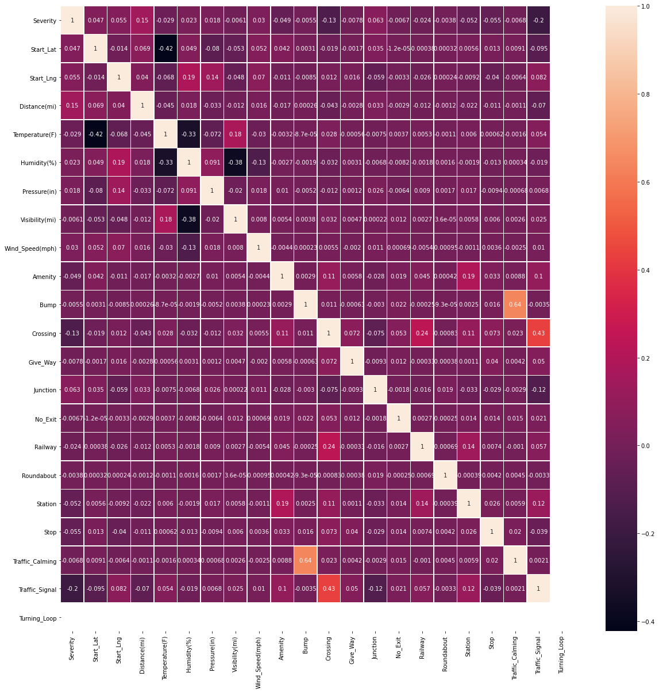


```python
## PLOT PAIRWISE CONTINUOUS FEATURES
FLOAT_COLUMNS = [
    'Severity'
    ,'Start_Lat'
    ,'Start_Lng'
    ,'Distance(mi)'    
    ,'Temperature(F)'
    ,'Humidity(%)'
    ,'Pressure(in)'
    ,'Visibility(mi)'
    ,'Wind_Speed(mph)'
]


subset = datafull_lite.loc[:, FLOAT_COLUMNS]

## note: takes some time to plot
sns.pairplot(subset)
```


    <seaborn.axisgrid.PairGrid at 0x20937867948>


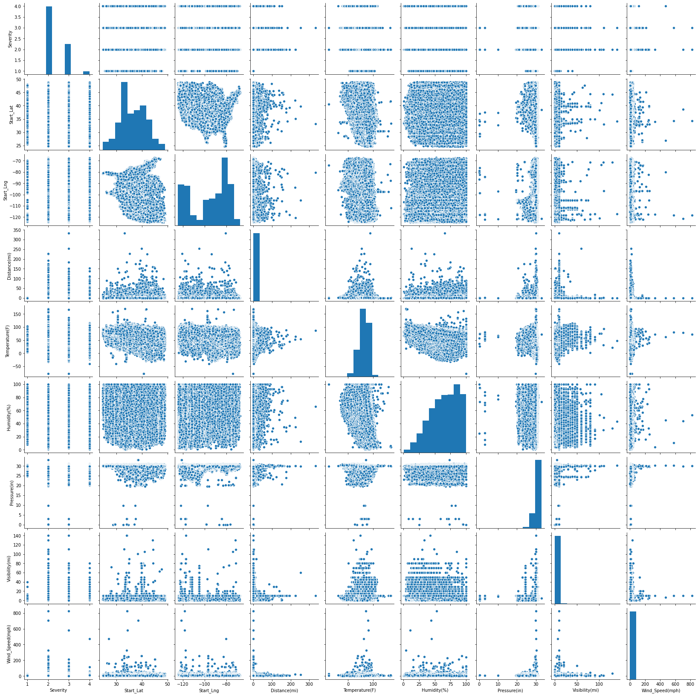


```python
## OUTLIERS CHECK ON CONTINUOUS FEATURES (removed Lat Long)
FLOAT_COLUMNS = [

    'Distance(mi)'    
    ,'Temperature(F)'
    ,'Humidity(%)'
    ,'Pressure(in)'
    ,'Visibility(mi)'
    ,'Wind_Speed(mph)'
]

    
for g in FLOAT_COLUMNS:
    
    fig, ax= plt.subplots(1, 1, figsize=(6, 4))
    ax = sns.boxplot(x=datafull_lite[g])   
    plt.show()
```


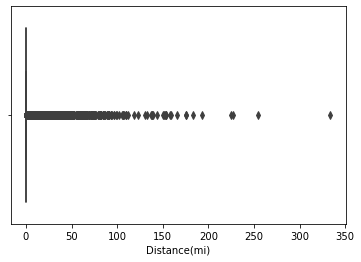


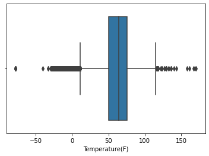


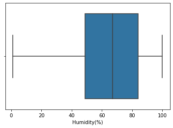


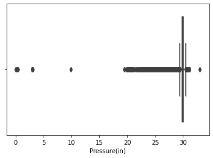


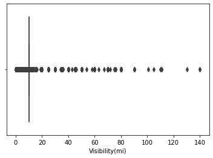


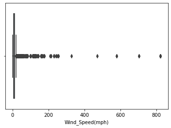


# CREATE BALANCED SAMPLED DATASET


```python
## RUN SCRIPT FOR BALANCED SAMPLING

%run sampling.py

```

    original shape: (2974335, 49)
    Severity
    1        968
    2    1993410
    3     887620
    4      92337
    Name: ID, dtype: int64
    after drop NA shape: (2506618, 30)
    Severity
    1        804
    2    1691223
    3     739481
    4      75110
    Name: ID, dtype: int64
    new shape: (3216, 30)
    excel file created
    

# EXPLORE CORRELATION ON SAMPLED DATASET


```python
## RUN SCRIPT ON SAMPLED DATASET
data, cols = loadAndProcessData('data/US_Accidents_Dec19_LITE_10000.csv', sampleSize = 3000)

## NOTE: within this samples, we don't have predictive power with Bump and Roundabout either.
```

    original shape: (10000, 30)
    Correlation plot for sampled dataset
    AxesSubplot(0.125,0.125;0.62x0.755)
    final shape: (3000, 144)
    


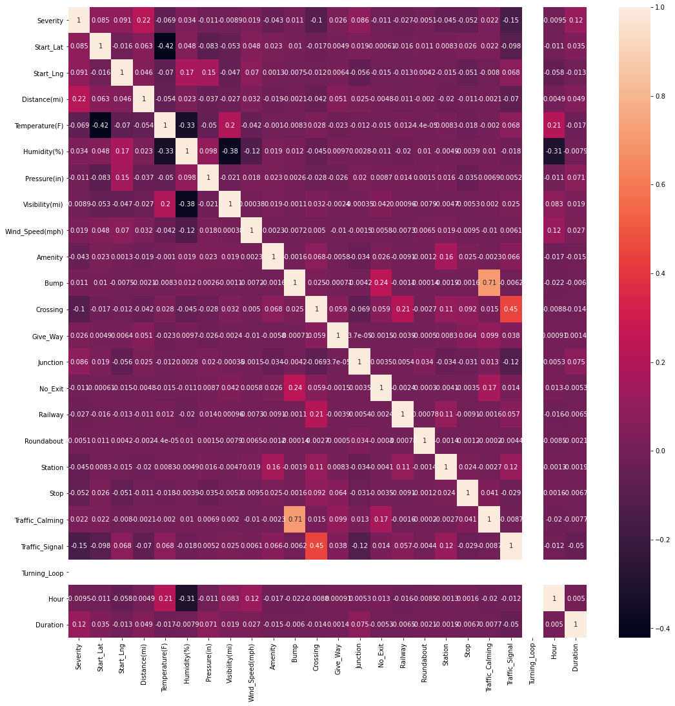


```python
## OUTLIERS CHECK ON CONTINUOUS FEATURES (removed Lat Long)
FLOAT_COLUMNS = [

    'Distance(mi)'    
    ,'Temperature(F)'
    ,'Humidity(%)'
    ,'Pressure(in)'
    ,'Visibility(mi)'
    ,'Wind_Speed(mph)'
]

    
for g in FLOAT_COLUMNS:
    
    fig, ax= plt.subplots(1, 1, figsize=(6, 4))
    ax = sns.boxplot(x=data[g])   
    plt.show()
```


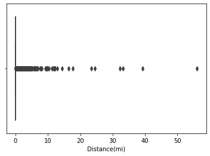


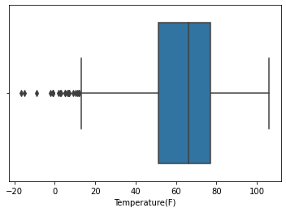


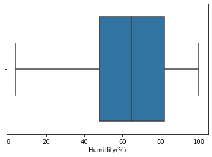


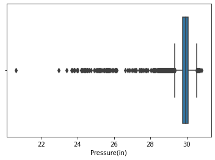


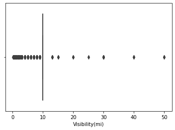


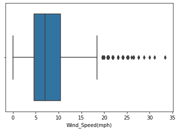


```python

```
